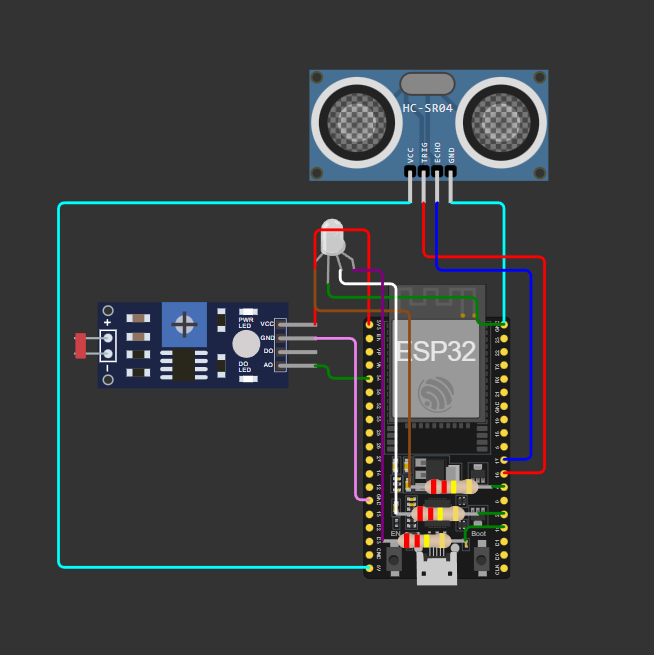
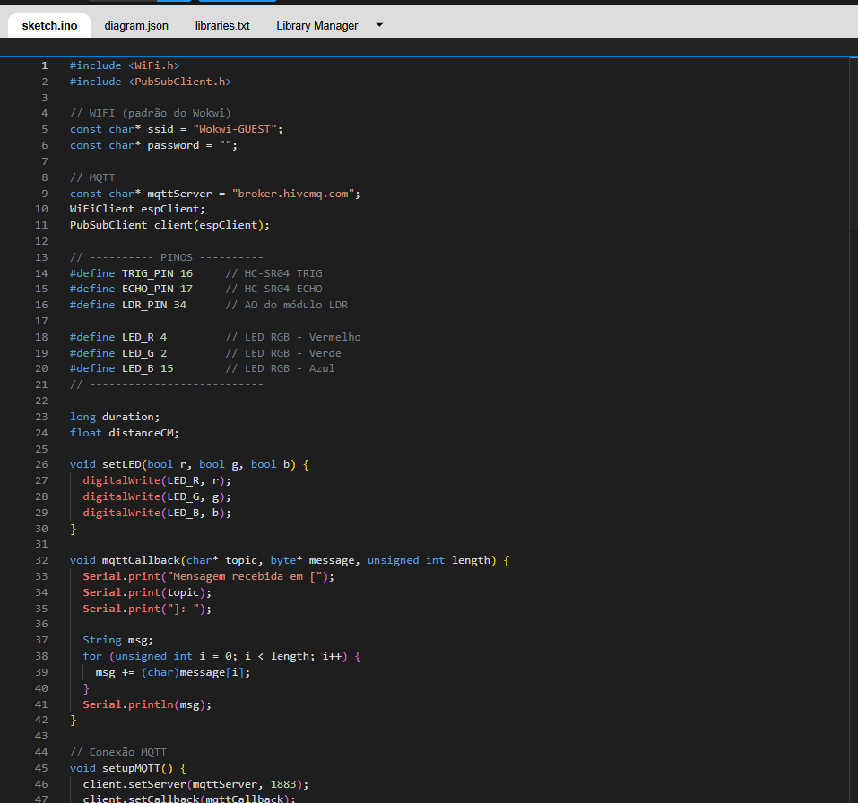

# ErgoSmart – Monitor de Ergonomia e Fadiga Ocular com ESP32 (IoT)

Projeto desenvolvido para a disciplina **Physical Computing (IoT & IoB)** dentro da **Global Solution 2025 – O Futuro do Trabalho**.

A proposta do **ErgoSmart** é monitorar, em tempo real, aspectos de **saúde e bem-estar no trabalho remoto**, utilizando um ESP32 e sensores simples para:
- Detectar **postura inadequada** (distância muito pequena da tela)
- Avaliar **qualidade da iluminação** (risco de fadiga ocular)
- Sinalizar o estado do usuário por meio de um **LED RGB**
- Enviar eventos para a nuvem via **MQTT**, possibilitando dashboards e monitoramento em ambientes corporativos

---

## 1. Problema

Com o aumento do trabalho remoto e híbrido, muitos profissionais passam horas em frente ao computador, frequentemente:

- Muito próximos da tela (postura inadequada)
- Em ambientes com **iluminação ruim**
- Sem pausas inteligentes ou monitoramento de bem-estar

Isso aumenta o risco de:
- **Dores musculoesqueléticas**
- **Fadiga ocular**
- **Queda de produtividade**
- **Burnout** a longo prazo

A maioria das empresas não possui mecanismos tecnológicos para acompanhar o **bem-estar ergonômico** dos colaboradores em home office.

---

## 2. Solução Proposta – ErgoSmart

O **ErgoSmart** é um protótipo IoT baseado em **ESP32**, que realiza:

### Sensores

- **Sensor Ultrassônico (HC-SR04)**  
  Mede a **distância entre o usuário e a tela**. Distâncias muito curtas são classificadas como **postura ruim**.

- **Sensor de Luz (módulo LDR com saída analógica – AO)**  
  Mede o nível de iluminação do ambiente. Valores baixos indicam **risco de fadiga ocular**.

### Atuadores

- **LED RGB**
  - **Verde** → postura e iluminação adequadas  
  - **Amarelo** → luz ruim, mas postura ok  
  - **Vermelho** → postura ruim (muito perto da tela)

### Comunicação IoT (MQTT)

O ESP32 se conecta à rede Wi-Fi e a um **broker MQTT público (`broker.hivemq.com`)**, publicando eventos em tópicos específicos que podem ser consumidos por dashboards, aplicações web ou sistemas de RH/saúde ocupacional.

---

## 3. Link do Projeto no Wokwi

O circuito e o código podem ser simulados diretamente no Wokwi:

👉 **Projeto público:**  
https://wokwi.com/projects/448195097724084225

---

## 4. Componentes Utilizados

- ESP32 DevKit (Wokwi)
- Sensor Ultrassônico HC-SR04
- Módulo LDR (photoresistor sensor com VCC, GND, DO, AO)
- LED RGB (catodo comum)
- 3 resistores de 220 Ω (um para cada cor do LED)
- Conexão Wi-Fi simulada no Wokwi
- Broker MQTT público (`broker.hivemq.com`)

---

## 5. Ligações do Circuito

### HC-SR04

- **VCC** → 5V do ESP32  
- **GND** → GND do ESP32  
- **TRIG** → GPIO **16**  
- **ECHO** → GPIO **17**

### Módulo LDR

- **VCC** → 3V3 do ESP32  
- **GND** → GND do ESP32  
- **AO** → GPIO **34**  
- **DO** → *não utilizado*

### LED RGB (catodo comum)

- **COM (pino maior)** → GND do ESP32  
- **R** → resistor 220 Ω → GPIO **4**  
- **G** → resistor 220 Ω → GPIO **2**  
- **B** → resistor 220 Ω → GPIO **15**

---

## 6. Imagens do Circuito

Coloque as imagens do circuito e da simulação (prints do Wokwi) em uma pasta, por exemplo `img/`, e referencie aqui:

```markdown


```
---

## 7. Dependências

- **Bibliotecas** (Arduino / Wokwi)
- **WiFi.h** (já incluída no core do ESP32)
- **PubSubClient.h** (instalada pelo Library Manager do Wokwi)

### Para rodar localmente no Arduino IDE:

- Instalar ESP32 Board via Boards Manager.
- Instalar a biblioteca PubSubClient (autor: Nick O’Leary).

---

## 8. Explicação dos tópicos MQTT utilizados

Neste projeto optamos por utilizar **apenas MQTT**, sem endpoints HTTP, pois MQTT é mais adequado para:
- comunicação contínua entre dispositivos IoT,
- envio de mensagens leves,
- possibilidade de vários assinantes (dashboards, apps, etc.).

O ESP32 atua como **cliente MQTT publicador**, conectado ao broker público `broker.hivemq.com` na porta `1883`.  
Ele publica mensagens em dois tópicos principais:

### 8.1. Tópico `ergosmart/posture`

- **Função:** notificar quando a postura do usuário está inadequada, ou seja, quando a distância medida pelo sensor ultrassônico (HC-SR04) é menor que 25 cm.
- **Quem publica:** ESP32 (projeto ErgoSmart).
- **Quando publica:** a cada ciclo de leitura, sempre que a condição de postura ruim é detectada.
- **Exemplo de payload enviado:**
  - `"Postura incorreta (muito perto da tela)"`

Esse tópico pode ser assinado por:
- um dashboard de ergonomia,
- um sistema de RH,
- um aplicativo que registre ocorrências de postura inadequada e sugira exercícios/pausas.

### 8.2. Tópico `ergosmart/light`

- **Função:** indicar que a iluminação do ambiente está baixa, aumentando o risco de fadiga ocular.
- **Quem publica:** ESP32.
- **Quando publica:** quando a leitura analógica do LDR (GPIO 34) é menor que um limiar definido (`< 2000`).
- **Exemplo de payload enviado:**
  - `"Luz baixa - risco de fadiga ocular"`

Esse tópico pode ser usado por:
- um painel de controle de saúde ocupacional,
- um sistema de automação que aumente a luz ambiente,
- um app que envie alertas ao colaborador sobre condições ruins de iluminação.

### 8.3. Possível extensão – tópico `ergosmart/command` (assinatura)

O código já está preparado para **assinar** o tópico:

- `ergosmart/command`

Ele ainda não é usado na lógica do projeto, mas foi planejado para futuras melhorias, como:
- ativar um **modo silencioso** (sem LED),
- alterar limiares de distância ou luminosidade em tempo real,
- mudar o comportamento do sistema sem reprogramar o ESP32.

Isso mostra como o projeto pode evoluir para um sistema IoT bidirecional (dispositivo ↔ servidor).

---

### 9. Como Executar
## No Wokwi

**Acesse o link:**
- https://wokwi.com/projects/448195097724084225
- Clique em “Start Simulation”.

**Para testar:**
- Clique no HC-SR04 e ajuste o slider de Distance (cm).
- Clique no módulo Photoresistor (LDR) e ajuste o slider de Illumination (lux).

**Observe:**
- Mudança das cores do LED RGB (verde, amarelo, vermelho).
- Valores de Distancia e Luz (LDR) no Serial Monitor.

---

### 9. Lógica do Sistema

O ESP32 conecta ao Wi-Fi Wokwi-GUEST.
- Em seguida, conecta ao broker MQTT (broker.hivemq.com).
- A cada ~1,5 segundos:
- Lê a distância pelo HC-SR04.
- Lê a luminosidade pelo LDR (GPIO 34).

## Classificação:

- **Postura ruim** → distância < 25 cm
- **Luz ruim** → valor analógico < 2000

## Ações:

- **Se postura ruim** → LED vermelho + publica em ergosmart/posture.
- **Senão, se luz ruim** → LED amarelo + publica em ergosmart/light.
- **Caso contrário** → LED verde (condição ideal).

---

### 11. Código sketch.ino totalmente comentado

```markdown
#include <WiFi.h>          // Biblioteca de WiFi do ESP32
#include <PubSubClient.h>  // Biblioteca para comunicação MQTT

// -------------------------
// Configuração de Wi-Fi
// -------------------------
// No Wokwi, a rede padrão é "Wokwi-GUEST" sem senha
const char* ssid = "Wokwi-GUEST";
const char* password = "";

// -------------------------
// Configuração de MQTT
// -------------------------
// Utilizamos um broker público gratuito para testes
const char* mqttServer = "broker.hivemq.com";
WiFiClient espClient;           // Cliente TCP
PubSubClient client(espClient); // Cliente MQTT usando o TCP

// -------------------------
// Definição dos pinos
// -------------------------
// Sensor ultrassônico HC-SR04
#define TRIG_PIN 16   // Pino TRIG do HC-SR04
#define ECHO_PIN 17   // Pino ECHO do HC-SR04

// Sensor de luz (módulo LDR) – saída analógica AO
#define LDR_PIN 34    // Pino analógico ligado ao AO do módulo LDR

// LED RGB (catodo comum)
#define LED_R 4       // Vermelho
#define LED_G 2       // Verde
#define LED_B 15      // Azul

// Variáveis auxiliares para o cálculo da distância
long duration;        // Tempo em microssegundos do pulso no ECHO
float distanceCM;     // Distância calculada em centímetros

// -------------------------
// Função para controlar o LED RGB
// -------------------------
// r, g e b são booleanos: HIGH (ligado) ou LOW (desligado)
void setLED(bool r, bool g, bool b) {
  digitalWrite(LED_R, r);
  digitalWrite(LED_G, g);
  digitalWrite(LED_B, b);
}

// -------------------------
// Função callback do MQTT
// -------------------------
// Executada quando chega alguma mensagem em tópicos assinados
void mqttCallback(char* topic, byte* message, unsigned int length) {
  Serial.print("Mensagem recebida em [");
  Serial.print(topic);
  Serial.print("]: ");

  String msg;
  for (unsigned int i = 0; i < length; i++) {
    msg += (char)message[i];  // Concatena cada caractere recebido
  }
  Serial.println(msg);

  // Aqui poderíamos tratar comandos futuros, ex:
  // if (msg == "silenciar") { ... }
}

// -------------------------
// Configuração inicial do cliente MQTT
// -------------------------
void setupMQTT() {
  // Informa o endereço do broker e porta
  client.setServer(mqttServer, 1883);
  // Define a função callback para mensagens recebidas
  client.setCallback(mqttCallback);
}

// -------------------------
// Função para reconectar ao broker MQTT
// -------------------------
void reconnectMQTT() {
  // Loop até conectar
  while (!client.connected()) {
    Serial.print("Conectando ao MQTT...");
    // "ErgoSmartClientPedro" é o ID do cliente MQTT
    if (client.connect("ErgoSmartClientPedro")) {
      Serial.println("conectado!");
      // Assina o tópico de comandos (pensado para futuras extensões)
      client.subscribe("ergosmart/command");
    } else {
      // Em caso de falha, mostra o código de erro e tenta novamente
      Serial.print("falhou, rc=");
      Serial.print(client.state());
      Serial.println(" tentando novamente em 2 segundos");
      delay(2000);
    }
  }
}

// -------------------------
// Leitura da distância com HC-SR04
// -------------------------
// Retorna a distância em centímetros
float readDistanceCM() {
  // Garante TRIG em nível baixo antes de gerar o pulso
  digitalWrite(TRIG_PIN, LOW);
  delayMicroseconds(2);

  // Pulso de 10us em TRIG para iniciar a medição
  digitalWrite(TRIG_PIN, HIGH);
  delayMicroseconds(10);
  digitalWrite(TRIG_PIN, LOW);

  // Mede o tempo que o pino ECHO fica em nível alto
  duration = pulseIn(ECHO_PIN, HIGH);

  // Conversão do tempo para distância (som do ar ≈ 0,034 cm/us, dividido por 2 ida/volta)
  float distance = duration * 0.034 / 2.0;
  return distance;
}

// -------------------------
// Função setup() – executa uma vez
// -------------------------
void setup() {
  Serial.begin(115200);  // Inicializa a comunicação serial para debug

  // Configuração dos pinos do sensor ultrassônico
  pinMode(TRIG_PIN, OUTPUT);
  pinMode(ECHO_PIN, INPUT);

  // Configuração dos pinos do LED RGB
  pinMode(LED_R, OUTPUT);
  pinMode(LED_G, OUTPUT);
  pinMode(LED_B, OUTPUT);

  // Inicialmente apaga o LED
  setLED(0, 0, 0);

  // -------------------------
  // Conexão Wi-Fi
  // -------------------------
  Serial.print("Conectando ao WiFi ");
  Serial.println(ssid);
  WiFi.begin(ssid, password);

  // Aguarda até conectar
  while (WiFi.status() != WL_CONNECTED) {
    delay(500);
    Serial.print(".");
  }

  Serial.println("\nWiFi conectado!");
  Serial.print("IP: ");
  Serial.println(WiFi.localIP());

  // -------------------------
  // Configura o cliente MQTT
  // -------------------------
  setupMQTT();
}

// -------------------------
// Loop principal – executa continuamente
// -------------------------
void loop() {
  // Garante que a conexão MQTT esteja ativa
  if (!client.connected()) {
    reconnectMQTT();
  }
  client.loop(); // Processa mensagens MQTT pendentes

  // -------------------------
  // Leitura da distância (postura)
  // -------------------------
  distanceCM = readDistanceCM();
  Serial.print("Distancia: ");
  Serial.print(distanceCM);
  Serial.println(" cm");

  // Considera postura ruim se estiver muito perto da tela (< 25cm)
  bool posturaRuim = distanceCM > 0 && distanceCM < 25.0;

  // Se a postura estiver ruim, publica mensagem no tópico correspondente
  if (posturaRuim) {
    client.publish("ergosmart/posture", "Postura incorreta (muito perto da tela)");
  }

  // -------------------------
  // Leitura da luminosidade (fadiga ocular)
  // -------------------------
  int luz = analogRead(LDR_PIN);  // Leitura do valor analógico do LDR
  Serial.print("Luz (LDR): ");
  Serial.println(luz);

  // Considera luz ruim quando o valor é muito baixo
  // (limiar definido empiricamente para a simulação)
  bool luzRuim = luz < 2000;

  // Se a iluminação for ruim, publica mensagem no tópico de luz
  if (luzRuim) {
    client.publish("ergosmart/light", "Luz baixa - risco de fadiga ocular");
  }

  // -------------------------
  // Controle do LED RGB
  // -------------------------
  // Prioridade:
  // 1) Vermelho  → postura ruim
  // 2) Amarelo   → luz ruim (postura ok)
  // 3) Verde     → tudo ok
  if (posturaRuim) {
    // LED vermelho (R=HIGH, G=LOW, B=LOW)
    setLED(HIGH, LOW, LOW);
  } 
  else if (luzRuim) {
    // LED amarelo (R=HIGH, G=HIGH, B=LOW)
    setLED(HIGH, HIGH, LOW);
  } 
  else {
    // LED verde (R=LOW, G=HIGH, B=LOW)
    setLED(LOW, HIGH, LOW);
  }

  // Intervalo entre as medições (1,5 segundos)
  delay(1500);
}
```
